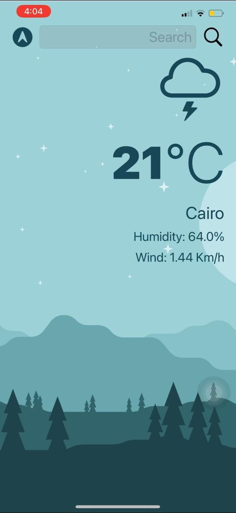
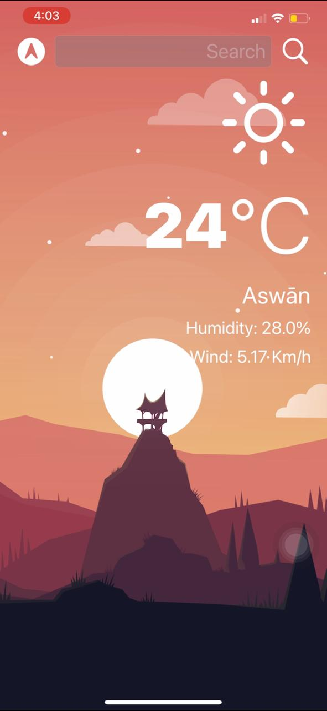

#  Clima Swift

## dark-mode enabled weather app. You'll be able to check the weather for the current location based on the GPS data from the iPhone as well as by searching for a city manually. 

* How to create a dark-mode enabled app.
* Swift protocols and extensions. 
* Used URLSession to network and make HTTP requests.
* Parse JSON with the native Encodable and Decodable protocols. 
* Used Core Location to get the current location from the phone GPS. 

